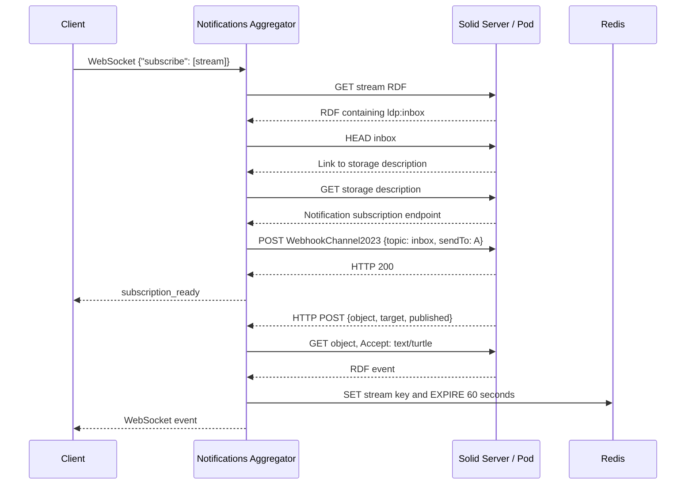

# Solid Notifications Aggregator

The Solid Notifications Aggregator is a research prototype that sits between Solid Pods and clients consuming streaming RDF data.

> A Solid Notifications intermediary that subscribes to stream updates once and distributes newly added RDF events to multiple WebSocket clients.

The service aggregates notifications and stream events. It does not execute RSP-QL queries and it does not aggregate query results. Stream processing remains the responsibility of the clients that receive the events.

In one sentence: subscribe once to a Solid stream, fetch each new resource once, and fan the event out to multiple clients.

## Motivation

If several clients are interested in the same stream and connect directly to a Solid Pod, each client may need to discover or create its own Solid Notifications subscription, receive the notification, and fetch the newly added resource:

```text
Solid Pod
├── notification + GET → Client A
├── notification + GET → Client B
└── notification + GET → Client C
```

With this service, the Pod-facing work is shared for clients that subscribe to the same exact stream URL:

```text
Solid Pod
      │
      │ one notification subscription and event GET
      ▼
Notifications Aggregator
  ├── WebSocket → Client A
  ├── WebSocket → Client B
  └── WebSocket → Client C
```

The aggregator therefore reduces repeated notification handling and repeated event retrieval against the Pod when multiple clients consume the same stream. It does not provide a query engine, durable event store, or client-side stream-processing semantics.

## Architecture


The diagram shows the aggregator receiving events from one or more Pods and serving multiple clients. A client can subscribe to one stream, several streams, or streams discovered from a Pod's Public Type Index. The runtime has one HTTP server that handles incoming webhook POSTs and cache requests, and a WebSocket server attached to that HTTP server for client communication.

The notification path is:

1. A client opens a WebSocket connection and sends a subscription message.
2. The aggregator retrieves the stream's LDP inbox and discovers the Solid Notifications subscription server.
3. It creates a `WebhookChannel2023` subscription whose callback is the aggregator's HTTP URL.
4. The Solid server sends webhook notifications to that HTTP URL.
5. The aggregator extracts the notification target, object, and publication time.
6. For a resource object, it performs one `GET` with `Accept: text/turtle`, stores the returned data temporarily in Redis, and sends the event through the WebSocket fan-out path.
7. The WebSocket handler forwards the message to every client registered for the normalized stream URL.

The implementation uses an internal WebSocket client connection from `NotificationServiceHTTPServer` to the WebSocket server attached to the same HTTP server. Incoming events are sent through that connection so that `WebSocketServerHandler` performs the fan-out.



For a container object, the handler does not fetch or cache the container as an event. It sends an internal `container_location` message to the WebSocket handler, which calls the inbox-subscription path for that location.

## How a subscription works

### Direct stream subscription

The direct interface accepts one or more stream URLs:

```json
{
  "subscribe": [
    "http://localhost:3000/aggregation_pod/aggregation/"
  ]
}
```

The client sends this JSON as a UTF-8 WebSocket message. The WebSocket connection must use the subprotocol `solid-stream-notifications-aggregator`.

For each stream, `WebSocketServerHandler` calls `set_connections(stream, connection)`. That method:

1. Adds the WebSocket connection to an internal map:

   ```text
   stream URL → WebSocket connections
   ```

2. Starts or reuses the upstream subscription promise for that exact stream URL.
3. Calls `extract_ldp_inbox` to `GET` the stream RDF and read its `ldp:inbox` value.
4. Calls `SubscribeNotification.subscribe_inbox` for the discovered inbox.
5. Sends the client a readiness message only after the upstream subscription returns HTTP status `200`:

   ```json
   {
     "type": "subscription_ready",
     "stream": "http://localhost:3000/aggregation_pod/aggregation/"
   }
   ```

`stream_subscriptions` stores one in-flight or completed subscription promise per exact stream URL. Consequently, concurrent clients subscribing to the same URL share one upstream Solid Notifications subscription, while each client is still added to the stream's WebSocket connection list and receives its own `subscription_ready` message. There is no unsubscribe message or connection-cleanup path implemented in `WebSocketServerHandler`.

### Metric-based stream discovery

The repository also supports discovering streams from a Pod's Public Type Index:

```json
{
  "subscribeByMetric": {
    "pod": "http://localhost:3000/pod/",
    "metrics": [
      "https://dahcc.idlab.ugent.be/Homelab/SensorsAndActuators/wearable.acceleration.x"
    ]
  }
}
```

`StreamDiscovery` performs the following requests, sequentially:

1. `GET <pod>/profile/card` and read `solid:publicTypeIndex`.
2. `GET` the Public Type Index and check whether at least one requested metric occurs as the object of `https://saref.etsi.org/core/relatesToProperty`.
3. Retrieve the profile and Public Type Index again.
4. Collect every `https://w3id.org/tree#view` object from the second Type Index read.
5. Pass the resulting stream URLs through the same `set_connections` path as a direct `subscribe` message.

The current implementation deliberately returns all `tree:view` values after finding a requested metric; it does not join each view to the particular Type Index registration that matched the metric. A missing metric, missing Public Type Index, malformed RDF, or missing `tree:view` produces an error. Discovery-based failures are sent to the client as:

```json
{
  "type": "subscription_error",
  "pod": "http://localhost:3000/pod/",
  "error": "..."
}
```

The direct `subscribe` interface remains supported. A failed direct subscription is logged by the current handler and does not send a `subscription_ready` message.

## Implementation flow

### `NotificationServiceHTTPServer`

`NotificationServiceHTTPServer` creates the HTTP server, attaches the WebSocket server to it, creates `CacheService`, and starts `WebSocketServerHandler`.

The HTTP request handler currently dispatches by method:

- `POST`: treats the request body as a Solid webhook notification.
- `GET`: reads the `event_time` query parameter and returns the corresponding Redis value with `Content-Type: text/turtle`.
- `DELETE`: deletes the Redis key named by `event_time`.
- Other methods: return `405 Method Not Allowed`.

For a webhook `POST`, the implementation:

1. Parses the JSON body.
2. Converts `notification.published` to an epoch-millisecond string named `published_time`.
3. Derives the stream from `notification.target` by replacing a trailing `/digits/` segment with `/`. This is the stream identifier used for the connection map and outgoing messages.
4. Reads `notification.object` as the resource location.

The object handling is based on the URL spelling, not on an RDF type check:

- If `notification.object` ends with `/`, it is treated as a container. The aggregator sends an internal message containing `stream`, `published_time`, and `container_location`. The WebSocket handler then attempts to subscribe to that container's notification inbox. The container is not fetched, cached, or sent to subscribed clients as an `event` by this branch.
- If it does not end with `/`, it is treated as a resource. The aggregator performs `axios.get(notification.object, { headers: { Accept: "text/turtle" } })`, caches the returned response under `stream:<stream>:<published_time>`, sets a 60-second Redis TTL, and sends an internal message containing `stream`, `published_time`, and the raw response as `event`.

The webhook endpoint returns `200 OK` for a successfully parsed notification. Invalid JSON returns `400 Bad Request`. Resource-fetch errors are logged; the current code still completes the outer notification request with `200 OK` and does not send the fetched event.

### `WebSocketServerHandler`

This class accepts WebSocket requests with the `solid-stream-notifications-aggregator` subprotocol and handles UTF-8 JSON messages. Its main state is:

```text
websocket_connections: stream URL → WebSocket[]
stream_subscriptions: stream URL → Promise<void>
```

When an `event` message arrives, the handler looks up the message's `stream` and sends the JSON message to every connection registered for that exact key. This is the notification fan-out mechanism. It is not query-result aggregation: every client receives the same event payload produced by the webhook path.

The handler also accepts `container_location` messages and passes the location to `SubscribeNotification.subscribe_inbox`. Unknown message shapes are logged and ignored.

### `SubscribeNotification`

The active WebSocket subscription path uses `subscribe_inbox`:

1. `extract_subscription_server(inbox)` sends `HEAD` to the inbox.
2. It reads the `Link` header for a link with relation `http://www.w3.org/ns/solid/terms#storageDescription`.
3. It `GET`s that storage-description resource and parses its RDF.
4. It reads the Solid Notifications subscription endpoint from `http://www.w3.org/ns/solid/notifications#subscription`.
5. It posts this JSON-LD document to that endpoint:

   ```json
   {
     "@context": ["https://www.w3.org/ns/solid/notification/v1"],
     "type": "http://www.w3.org/ns/solid/notifications#WebhookChannel2023",
     "topic": "<inbox URL>",
     "sendTo": "<notif_aggregator_http_server_url>"
   }
   ```

   The request uses `Content-Type: application/ld+json`.

The `topic` in this active path is the discovered inbox URL. The `sendTo` value comes from `src/config/notif_aggregator_setup.json`. A status other than `200` is treated as a failed subscription.

The class also contains a `subscribe_stream` helper that posts a similar `WebhookChannel2023` document with the stream URL as its topic, but `WebSocketServerHandler.set_connections` uses the inbox-based method described above.

### `CacheService`

`CacheService` uses `ioredis` and connects to Redis with its default settings, which means `localhost:6379` unless the code is changed to provide other options. Redis is required by the running HTTP server because `NotificationServiceHTTPServer` creates a cache service at startup.

The cache is temporary notification storage, not the primary persistent storage layer for the Pod or the stream. Resource notifications are stored as the fetched response text under keys of the form:

```text
stream:<normalized stream URL>:<published epoch milliseconds>
```

The webhook path applies a TTL of 60 seconds to each cached resource. `CacheService` also exposes methods for reading, deleting, scanning, and clearing Redis values; the normal WebSocket delivery path sends the event immediately after caching it.

## Running the prototype

### Prerequisites

- Node.js and npm
- A Redis server reachable at `localhost:6379` by default
- A Solid server or Pod that supports Solid Notifications `WebhookChannel2023`
- For direct subscriptions, a stream resource whose RDF exposes an `ldp:inbox`
- For `subscribeByMetric`, a Pod profile and Public Type Index using the predicates expected by `StreamDiscovery`

The Solid server must be able to send its webhook HTTP POST to the aggregator's configured callback URL. The callback URL is not inferred from the WebSocket URL.

### Install and start

```bash
npm install
npm run start
```

`npm run start` compiles the TypeScript sources and starts the `cache-notifications` command on port `8085` by default. The WebSocket endpoint is therefore normally:

```text
ws://localhost:8085/
```

The command also accepts a port option when run from the compiled output:

```bash
npm run build
node dist/index.js cache-notifications --port 8085
```

The current internal event relay connects specifically to `ws://localhost:8085/`, so using a different listener port is not a complete runtime configuration change by itself.

### Configure the webhook callback

Edit `src/config/notif_aggregator_setup.json` before building:

```json
{
  "notif_aggregator_http_server_url": "http://<reachable-aggregator-host>:8085/",
  "notif_aggregator_ws_server_url": "ws://<aggregator-host>:8085/"
}
```

`SubscribeNotification` currently reads `notif_aggregator_http_server_url` for the `sendTo` field in new Solid Notifications subscriptions. The checked-in file contains a testbed hostname. `notif_aggregator_ws_server_url` is present in the configuration file but is not currently read by the runtime; the internal relay uses the hard-coded localhost WebSocket URL described above.

The client-facing WebSocket connection should use the subprotocol shown in this example:

```ts
import { WebSocket } from "ws";

const socket = new WebSocket(
  "ws://localhost:8085/",
  "solid-stream-notifications-aggregator",
  { perMessageDeflate: false }
);

socket.once("open", () => {
  socket.send(JSON.stringify({
    subscribe: ["http://localhost:3000/aggregation_pod/aggregation/"]
  }));
});

socket.on("message", data => {
  console.log(data.toString());
});
```

For a resource notification, the client receives a JSON message shaped like:

```json
{
  "stream": "http://localhost:3000/aggregation_pod/aggregation/",
  "published_time": "1710250027636",
  "event": "<raw RDF response in Turtle or the representation returned by the Pod>"
}
```

`event` is the fetched response text. The aggregator does not parse it into a query result or apply an RSP-QL query.

## Development and tests

```bash
npm run build
npm test
npm run lint:ts
```

The tests cover utility discovery, Public Type Index stream discovery, WebSocket subscription sharing, and Redis cache operations. Tests that instantiate `CacheService` require Redis at `localhost:6379`. The repository also contains a one-shot initialization timing script:

```bash
npm run benchmark:init:once
```

That script requires `BENCHMARK_POD_URL` and `BENCHMARK_METRIC_URI` environment variables and performs live discovery and subscription requests; it is separate from the normal service startup.

## Repository map

- `src/index.ts` — CLI entry point, logging, resource-usage logging, and the `cache-notifications` command.
- `src/server/NotificationServiceHTTPServer.ts` — HTTP webhook/cache endpoint and attached WebSocket server.
- `src/server/WebSocketServerHandler.ts` — client subscription handling, stream-to-connection mapping, and event fan-out.
- `src/service/SubscribeNotification.ts` — Solid Notifications subscription creation.
- `src/service/StreamDiscovery.ts` — Public Type Index-based metric-to-stream discovery.
- `src/service/CacheService.ts` — Redis access and temporary notification storage.
- `src/utils/Util.ts` — LDP inbox and notification subscription-server discovery helpers.
- `src/config/notif_aggregator_setup.json` — configured webhook callback and WebSocket URLs; only the HTTP callback is currently consumed by the subscription code.
- `architecture.png` and `architecture.drawio` — architecture artwork and its editable diagram source.

## Scope and security note

This codebase is a research prototype. The repository's security policy notes that the current version does not support authentication and authorization on the Solid Pod, and the implementation does not add an authentication layer for WebSocket clients or webhook requests. Deploy and evaluate it only in an environment appropriate for that limitation.

## License

Copyright Ghent University - imec. The project is released under the [MIT License](./LICENCE).

## Contact

For questions, open an issue in the repository or contact [Kush](mailto:kushbisen@proton.me).
